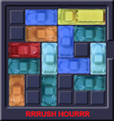
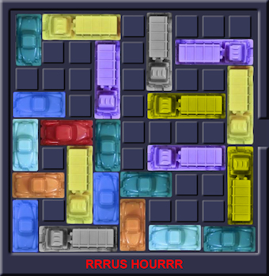
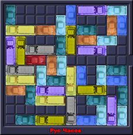

# Rushhour

Rush Hous is een schuifpuzzel, waarbij het doel is om de rode auto naar de uitgang te verplaatsen door andere auto's te verplaatsen en dit in zo min mogelijk stappen te doen. De auto's verschillen van oriëntatie en mogen alleen in de oorspronkelijke richting bewegen. De auto's komen voor in verschillende formaten: auto's van 2 blokjes en trucks van 3 blokjes. Ook de borden kunnen verschillen van formaten, zo bestaan er borden van 6x6, 9x9 en 12x12. 


  

## Aan de slag
## Browser Support

 |  |  |  |  | 


### Vereisten

Voor het project hebben wij de volgende programma's gebruikt.
*[python](https://www.python.org/downloads/)<br>

### Gebruik

1. Installeer python
[mac](https://www.python.org/downloads/mac-osx/)
[windows](https://www.python.org/downloads/windows/)

2. Kloon deze repository
```sh
git clone https://github.com/MeesTD/ProjectBois
```

De verschillende algorimtes kunnen worden aangeroepen door main.py aan te roepen met het algoritme die u wenst te gebruiken. EVEN CHECKEN HOE WE ALGROTIMES AAN ROEPEN-------

### Structuur 
Deze lijst beschrijft alle belangrijke mappen en files van het project, en hun locaties:

* **/code**: bevat alle code van dit project.
	* **/code/algorithms**: bevat de random, breadthfirst en astar algoritmes.
	* **/code/objects**: bevat de objecten board, car, lookahead, route en rushhour.
* **/data**: bevat alle cvs bestanden met auto's van alle borden.
	* **/data/outputs**: Deze folder bevat alle outputs van de algorithmes. 

### Auteurs
- Mees van drissen
- Mats pijning
- Zeno Degenkamp

### Licentie

Copyrigth 2019 Alle rechten voorbehouden

